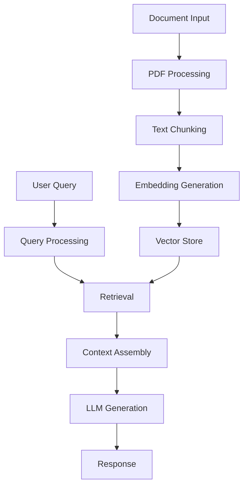

# End-to-End Pipeline

This section explains how all components work together in the complete RAG pipeline, from document ingestion to answer generation.

## Pipeline Overview



## Complete Implementation

### Pipeline Class

```python
class RAGPipeline:
    def __init__(self, config=None):
        self.config = config or self.default_config()
        self.setup_components()
        
    def setup_components(self):
        """Initialize all pipeline components."""
        # Initialize embedding model
        self.embedding_model = SentenceTransformer(
            self.config['embedding']['model_name']
        )
        
        # Initialize generator
        self.generator = AdvancedGenerator(
            model_name=self.config['generator']['model_name']
        )
        
        # Initialize empty index
        self.index = None
        self.chunks = []
        self.metadata = {}
        
    @staticmethod
    def default_config():
        return {
            'embedding': {
                'model_name': 'all-MiniLM-L6-v2',
                'normalize': True
            },
            'chunking': {
                'chunk_size': 1000,
                'chunk_overlap': 200
            },
            'retriever': {
                'top_k': 3,
                'threshold': 0.6
            },
            'generator': {
                'model_name': 'gemini-2.5-flash',
                'temperature': 0.3
            }
        }
        
    def ingest_document(self, file_path):
        """
        Process a document and add to index.
        """
        # Extract text
        text = self.extract_text(file_path)
        
        # Create chunks
        new_chunks = self.create_chunks(
            text,
            size=self.config['chunking']['chunk_size'],
            overlap=self.config['chunking']['chunk_overlap']
        )
        
        # Generate embeddings
        embeddings = self.embedding_model.encode(
            new_chunks,
            normalize_embeddings=self.config['embedding']['normalize']
        )
        
        # Update index
        self.update_index(new_chunks, embeddings)
        
        return len(new_chunks)
    
    def answer_question(self, query):
        """
        Generate answer for a question.
        """
        if not self.index:
            raise ValueError("No documents indexed yet")
            
        # Get query embedding
        query_emb = self.embedding_model.encode(
            [query],
            normalize_embeddings=self.config['embedding']['normalize']
        )
        
        # Retrieve relevant chunks
        contexts = self.retrieve(
            query_emb,
            k=self.config['retriever']['top_k']
        )
        
        # Generate answer
        response = self.generator.generate(
            query=query,
            contexts=[c['text'] for c in contexts],
            temperature=self.config['generator']['temperature']
        )
        
        return {
            'answer': response,
            'sources': contexts
        }
```

## Usage Example

```python
# Initialize pipeline
pipeline = RAGPipeline()

# Ingest documents
doc_path = "example.pdf"
num_chunks = pipeline.ingest_document(doc_path)
print(f"Processed {num_chunks} chunks")

# Ask questions
query = "What are the key points about RAG?"
result = pipeline.answer_question(query)
print(f"Answer: {result['answer']}")
print("\nSources:")
for src in result['sources']:
    print(f"- Score: {src['score']:.3f}")
    print(f"  Text: {src['text'][:100]}...")
```

## Pipeline Components

### 1. Document Processing

```python
def extract_text(self, file_path):
    """Extract text from PDF."""
    reader = PdfReader(file_path)
    text = ""
    for page in reader.pages:
        text += page.extract_text()
    return text

def create_chunks(self, text, size=1000, overlap=200):
    """Create overlapping text chunks."""
    chunks = []
    start = 0
    
    while start < len(text):
        end = start + size
        chunk = text[start:end]
        chunks.append(chunk)
        start = end - overlap
        
    return chunks
```

### 2. Index Management

```python
def update_index(self, chunks, embeddings):
    """Update FAISS index with new embeddings."""
    # Convert to numpy array
    embeddings = np.array(embeddings).astype('float32')
    
    if self.index is None:
        # Create new index
        d = embeddings.shape[1]
        self.index = faiss.IndexFlatL2(d)
        
    # Add to index
    self.index.add(embeddings)
    
    # Update chunks list
    start_idx = len(self.chunks)
    self.chunks.extend(chunks)
    
    # Add metadata
    for i, chunk in enumerate(chunks, start=start_idx):
        self.metadata[i] = {
            'id': i,
            'text': chunk
        }
```

### 3. Retrieval Logic

```python
def retrieve(self, query_emb, k=3):
    """Retrieve similar chunks."""
    # Search index
    D, I = self.index.search(
        query_emb.astype('float32'),
        k
    )
    
    # Get results with metadata
    results = []
    for dist, idx in zip(D[0], I[0]):
        results.append({
            'text': self.chunks[idx],
            'score': float(dist),
            'metadata': self.metadata[idx]
        })
    
    return results
```

## Advanced Features

### 1. Batch Processing

```python
def batch_ingest_documents(self, file_paths, batch_size=32):
    """Process multiple documents in batches."""
    total_chunks = 0
    for path in file_paths:
        chunks = self.ingest_document(path)
        total_chunks += chunks
    return total_chunks
```

### 2. Index Persistence

```python
def save_state(self, directory):
    """Save index and metadata."""
    os.makedirs(directory, exist_ok=True)
    
    # Save FAISS index
    index_path = os.path.join(directory, 'index.faiss')
    faiss.write_index(self.index, index_path)
    
    # Save metadata
    meta_path = os.path.join(directory, 'metadata.json')
    with open(meta_path, 'w') as f:
        json.dump({
            'chunks': self.chunks,
            'metadata': self.metadata,
            'config': self.config
        }, f)

def load_state(self, directory):
    """Load saved index and metadata."""
    # Load FAISS index
    index_path = os.path.join(directory, 'index.faiss')
    self.index = faiss.read_index(index_path)
    
    # Load metadata
    meta_path = os.path.join(directory, 'metadata.json')
    with open(meta_path, 'r') as f:
        data = json.load(f)
        self.chunks = data['chunks']
        self.metadata = data['metadata']
        self.config.update(data['config'])
```

## Best Practices

1. **Error Handling**
   - Validate inputs
   - Graceful degradation
   - Clear error messages

2. **Performance**
   - Batch processing
   - Caching results
   - Index optimization

3. **Maintenance**
   - Regular index updates
   - State persistence
   - Monitoring

## Next Steps

- See [Examples](../examples/basic-retrieval.md)
- Learn about [Evaluation](../examples/evaluation.md)
- Explore [Deployment](../deployment/local.md)