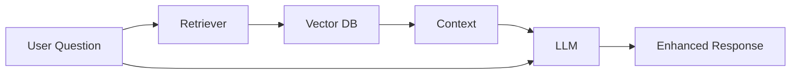
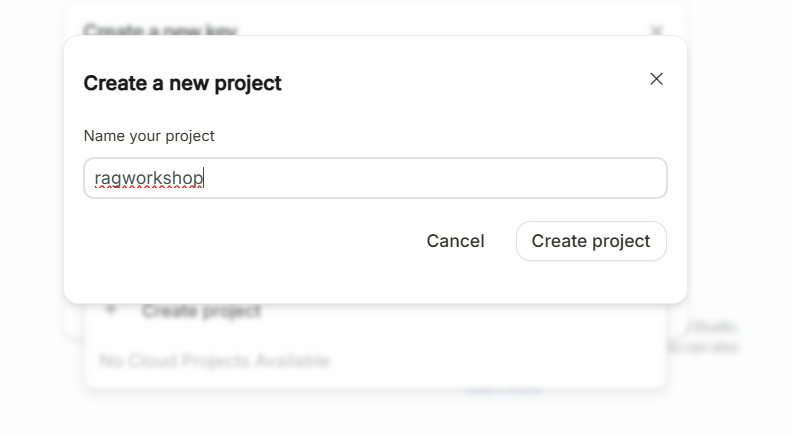
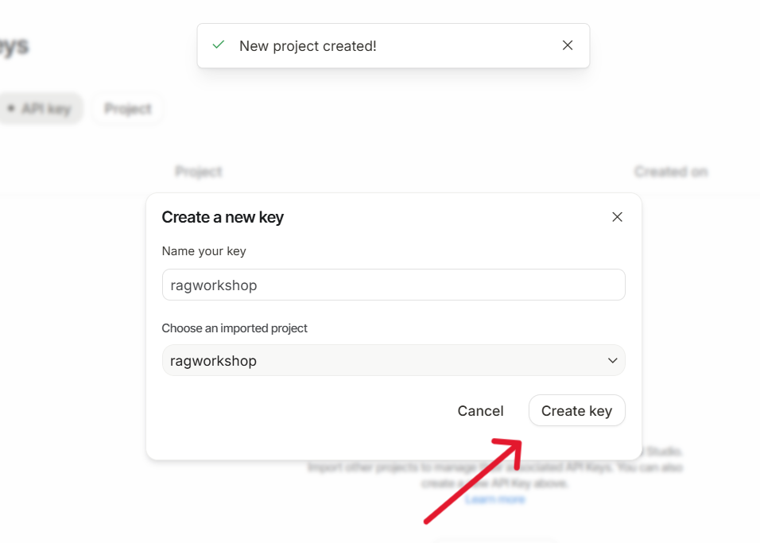
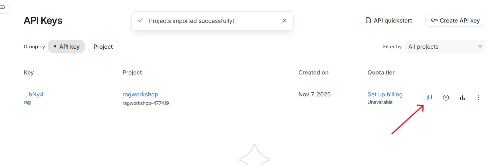
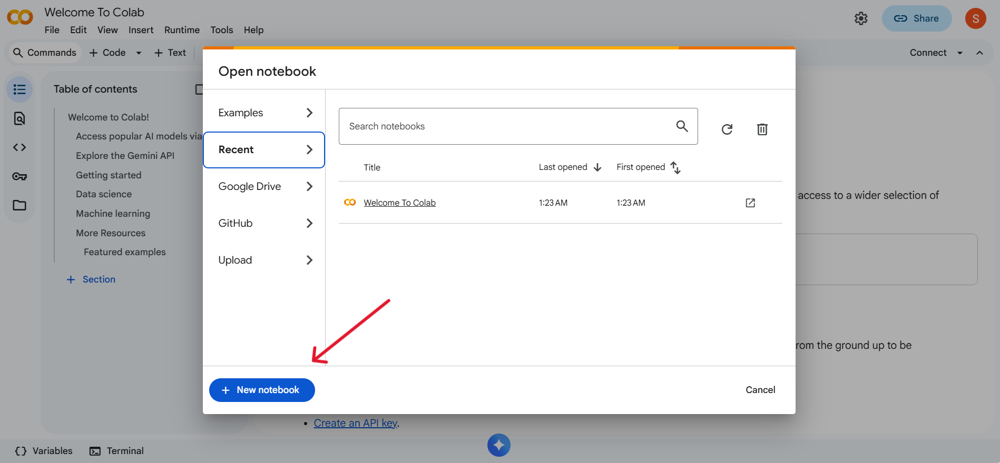
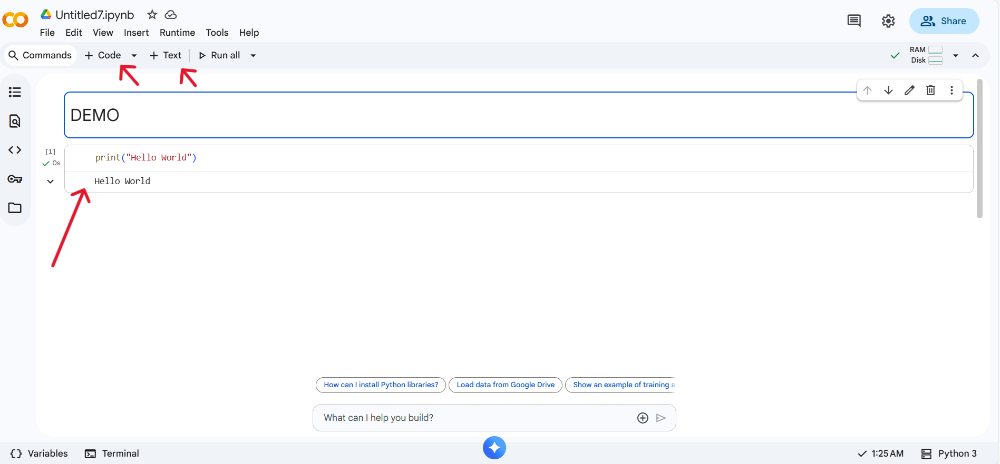
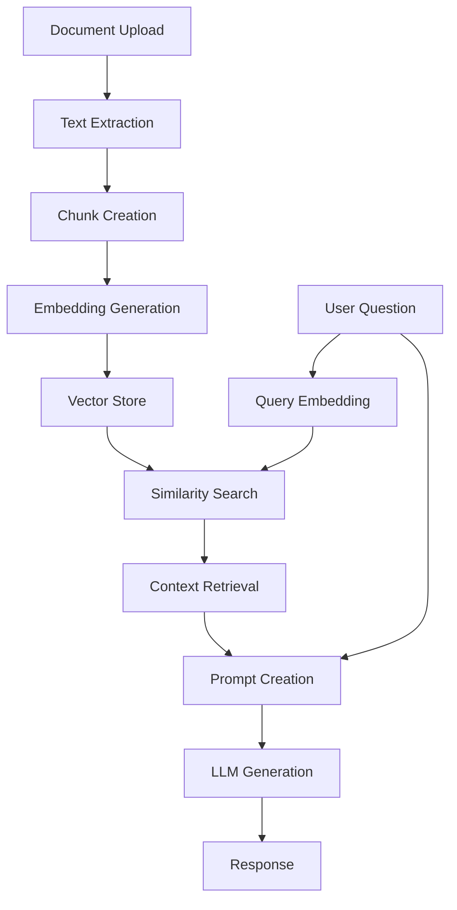

# Retrieval-Augmented Generation (RAG) with Hugging Face and Gemini

### What is RAG?

Retrieval-Augmented Generation (RAG) is a powerful technique that enhances Large Language Models (LLMs) by providing them with relevant external information during text generation. Imagine giving your AI assistant a personal library that it can reference while answering your questions.

### How does it work?

1. **Retrieval**: When you ask a question (a "query"), the system searches a knowledge base (in our case, the text from a PDF you upload) to find the most relevant snippets of text.
2. **Augmentation**: These relevant text snippets are then added to your original query to form a new, more detailed prompt.
3. **Generation**: This augmented prompt is sent to an LLM (like Google's Gemini), which then generates an answer based on the provided context.



This process allows the LLM to answer questions about specific documents it wasn't originally trained on.


### How RAG Improves LLM Responses

1. **Enhanced Accuracy** ✓
   ```mermaid
   graph LR
       A[Basic LLM] -->|Without RAG| B[Possible Hallucination]
       A -->|With RAG| C[Factual Response]
       style C fill:#9f9,stroke:#333
       style B fill:#f99,stroke:#333
   ```

2. **Knowledge Integration** 📚
   ```mermaid
   graph TD
       A[Your Documents] --> B[RAG System]
       C[LLM Knowledge] --> B
       B --> D[Combined Intelligence]
       style D fill:#9f9,stroke:#333
   ```

3. **Real-time Updates** 🔄
   ```mermaid
   graph LR
       A[New Information] --> B[Knowledge Base]
       B --> C[Immediate Availability]
       C --> D[Updated Responses]
       style D fill:#9f9,stroke:#333
   ```


## Getting Started

### Prerequisites

Before we begin, you'll need:

1. **Google AI API Key**:
      - Visit [Google AI Studio](https://aistudio.google.com/) and look for "Get API key" in the sidebar. Click Create API key.
      
      
      
      - Name your key and click "create project" in the dropdown Create a new project  
      
              
      
      
      - Click "Create key"
      

      - Copy and save your API key safely
      


### Setting Up Google Colab

1. **Create a new notebook**:
      - Go to [Google Colab](https://colab.research.google.com)
      - Click "New Notebook"
      

2. **Basic Colab operations**:
      - Add code cell: Click "+ Code" or use Ctrl+M B
      - Add text cell: Click "+ Text" or use Ctrl+M M
      - Run cell: Click play button or use Shift+Enter
      

### 1. Installing Dependencies

First, let's install the required packages:

```python
!pip install -q google-generativeai pypdf sentence-transformers faiss-cpu
```

These packages provide:
      - `google-generativeai`: Access to Google's Gemini model
      - `pypdf`: PDF document processing capabilities
      - `sentence-transformers`: Text embedding generation
      - `faiss-cpu`: Fast similarity search for vectors

### 2. API Configuration

Set up the Gemini API:

```python
import os
import getpass
import google.generativeai as genai

# Get API key securely
if "GEMINI_API_KEY" not in os.environ:
    os.environ["GEMINI_API_KEY"] = getpass.getpass("Enter your Gemini API key: ")

# Configure Gemini
genai.configure(api_key=os.environ["GEMINI_API_KEY"])
model = genai.GenerativeModel('gemini-2.5-flash')
```
Imports necessary modules and sets up the Gemini API key securely using getpass.
Configures the API with the provided key and initializes the gemini-2.5-flash model.

### 3. Document Processing

Now we'll process PDF documents:

```python
from google.colab import files
from pypdf import PdfReader

def process_pdf():
    """Upload and process a PDF document."""
    print("Upload your PDF")
    uploaded = files.upload()
    
    if uploaded:
        # Get the filename
        pdf_filename = next(iter(uploaded))
        print(f"Processing: {pdf_filename}")
        
        # Read PDF content
        reader = PdfReader(pdf_filename)
        pdf_text = ""
        for page in reader.pages:
            pdf_text += page.extract_text()
        
        # Split into chunks
        text_chunks = [pdf_text[i:i + 1000] for i in range(0, len(pdf_text), 1000)]
        print(f"Created {len(text_chunks)} text chunks")
        return text_chunks
    return None

text_chunks = process_pdf()
```
Prompts the user to upload a PDF file using google.colab.files.upload().
Reads the uploaded file with PdfReader from the pypdf library and extracts its text.
Processes the extracted PDF text by splitting it into smaller chunks using sentence-transformers utilities.
These chunks are essential for embedding creation, making it easier for the RAG model to retrieve relevant text segments later.

!!! note "Document Processing"
    The chunk size of 1000 characters is a balance between:
    - Context window limitations
    - Semantic coherence
    - Processing efficiency

### 4. Embedding Generation

Now we'll create vector representations of our text:

```python
from sentence_transformers import SentenceTransformer

# Initialize the embedding model
embedding_model = SentenceTransformer('all-MiniLM-L6-v2')

# Generate embeddings
embeddings = embedding_model.encode(text_chunks)
print(f"Created {len(embeddings)} embeddings of dimension {embeddings.shape[1]}")
```
Generates vector embeddings for each text chunk using a pretrained SentenceTransformer model.
Stores both the text chunks and their corresponding embeddings in memory.
This forms the foundational dataset for performing semantic similarity searches during question-answering.

!!! info "About Embeddings"
    - Uses all-MiniLM-L6-v2 model
    - Creates 384-dimensional vectors
    - Captures semantic meaning
    - Enables similarity search

### 5. Vector Store Setup

We'll use FAISS to create a searchable database:

```python
import faiss
import numpy as np

# Create FAISS index
d = embeddings.shape[1]  # embedding dimension
index = faiss.IndexFlatL2(d)
index.add(np.array(embeddings).astype('float32'))
print(f"Created FAISS index with {index.ntotal} vectors")
```
Initializes a FAISS index to store and search through embeddings efficiently.
Adds all the computed embeddings to the FAISS index, allowing rapid nearest-neighbor searches.
This setup enables quick retrieval of the most relevant chunks based on query similarity.

!!! tip "FAISS Configuration"
    - Uses L2 distance metric
    - Performs exact search
    - Optimized for speed
    - Scales well with data

### 6. RAG Implementation

Here's our core RAG implementation:

```python
def get_rag_answer(query, k=3):
    """
    Performs retrieval-augmented generation.
    
    Args:
        query: User question
        k: Number of chunks to retrieve
    """
    # 1. Retrieval
    print("Converting query to embedding...")
    query_embedding = embedding_model.encode([query])
    
    print("Searching for relevant chunks...")
    distances, indices = index.search(
        np.array(query_embedding).astype('float32'),
        k
    )

    # 2. Augmentation
    print("Building context from chunks...")
    retrieved_chunks = [text_chunks[i] for i in indices[0]]
    context = "\n\n".join(retrieved_chunks)
    
    prompt = f"""Based on the following context, answer the question.
    Be clear, specific, and cite relevant information from the context.

Context:
{context}

Question: {query}

Answer:"""
    
    # 3. Generation
    print("Generating response...")
    response = model.generate_content(prompt)
    return response.text

# Example usage
example_question = "What are the key concepts discussed in the document?"
print("\nExample Question:", example_question)
print("\nAnswer:", get_rag_answer(example_question))
```
Implements a search function that takes a user query, embeds it, and retrieves the most similar text chunks using FAISS.
Combines these retrieved chunks into a context to be passed to the Gemini model.
This function is key to the “retrieval” part of the RAG pipeline, ensuring answers are contextually grounded in the document.

### 7. Interactive Interface

Let's create a user-friendly interface:

```python
import gradio as gr

def chat_with_pdf(question, history):
    """Handle chat interface."""
    if not question.strip():
        return "Please enter a question."
    
    try:
        answer = get_rag_answer(question)
        return answer
    except Exception as e:
        return f"Error: {str(e)}"

# Create interface
with gr.Blocks(theme=gr.themes.Soft()) as demo:
    gr.Markdown("# 📚 RAG-Powered Document Q&A")
    
    with gr.Row():
        with gr.Column():
            question_input = gr.Textbox(
                label="Your Question",
                placeholder="Ask about your document...",
                lines=3
            )
            submit_btn = gr.Button("Ask Question")
        
        with gr.Column():
            answer_output = gr.Textbox(
                label="Answer",
                lines=10
            )
    
    # Example questions
    gr.Examples([
        ["What are the main topics discussed?"],
        ["Summarize the key points in the document"],
        ["What specific details are mentioned about...?"]
    ], inputs=question_input)
    
    # Set up interaction
    submit_btn.click(
        fn=lambda q: chat_with_pdf(q, None),
        inputs=question_input,
        outputs=answer_output
    )

demo.launch(debug=True, share=True)
```
Defines a chat or question-answering interface that accepts user queries.
For each question, it retrieves relevant content using FAISS and generates an answer using the Gemini model.
This block demonstrates the complete RAG workflow, combining retrieval and generation for document-based Q&A.

### Summary of System Architecture



