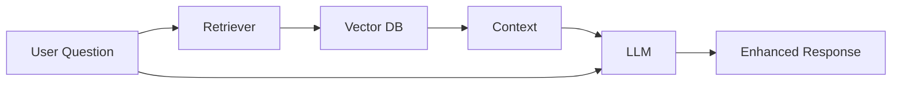
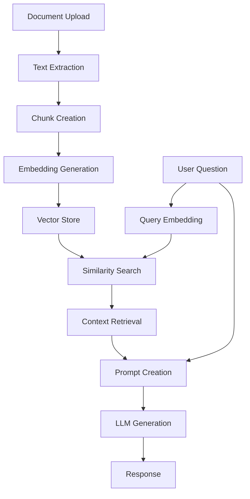

# Retrieval-Augmented Generation (RAG) with Hugging Face and Gemini

### What is RAG?

Retrieval-Augmented Generation (RAG) is a powerful technique that enhances Large Language Models (LLMs) by providing them with relevant external information during text generation. Imagine giving your AI assistant a personal library that it can reference while answering your questions.

### How does it work?

1. **Retrieval**: When you ask a question (a "query"), the system searches a knowledge base (in our case, the text from a PDF you upload) to find the most relevant snippets of text.
2. **Augmentation**: These relevant text snippets are then added to your original query to form a new, more detailed prompt.
3. **Generation**: This augmented prompt is sent to an LLM (like Google's Gemini), which then generates an answer based on the provided context.



This process allows the LLM to answer questions about specific documents it wasn't originally trained on.


### How RAG Improves LLM Responses

1. **Enhanced Accuracy** ✓
   ```mermaid
   graph LR
       A[Basic LLM] -->|Without RAG| B[Possible Hallucination]
       A -->|With RAG| C[Factual Response]
       style C fill:#9f9,stroke:#333
       style B fill:#f99,stroke:#333
   ```

2. **Knowledge Integration** 📚
   ```mermaid
   graph TD
       A[Your Documents] --> B[RAG System]
       C[LLM Knowledge] --> B
       B --> D[Combined Intelligence]
       style D fill:#9f9,stroke:#333
   ```

3. **Real-time Updates** 🔄
   ```mermaid
   graph LR
       A[New Information] --> B[Knowledge Base]
       B --> C[Immediate Availability]
       C --> D[Updated Responses]
       style D fill:#9f9,stroke:#333
   ```


## Getting Started

### Prerequisites

Before we begin, you'll need:

1. **Google AI API Key**:
      - Visit [Google AI Studio](https://aistudio.google.com/) and look for "Get API key" in the sidebar. Click Create API key.
      
      
      
      - Name your key and click "create project" in the dropdown Create a new project  
      
              
      
      
      - Click "Create key"
      

      - Copy and save your API key safely
      


### [Demo of RAG in Google Colab (Click)](https://colab.research.google.com/drive/1-KGV7GIA-ZbkcTexDqhcAZV9X13Ie8q6?usp=sharing)


### Summary of System Architecture



