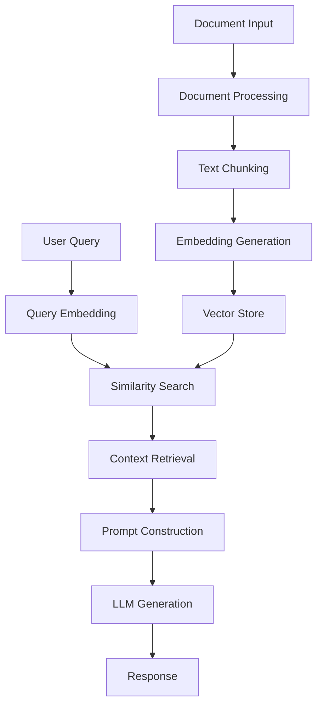

# Project Overview

## What is RAG?

Retrieval-Augmented Generation (RAG) is a powerful technique that enhances Large Language Models (LLMs) by providing them with relevant context from a knowledge base during the generation process. Instead of relying solely on the model's training data, RAG allows the model to reference specific documents or data sources when answering questions.

## How RAG Works

### 1. Document Processing
- Documents are split into manageable chunks
- Each chunk is converted into a vector embedding
- Embeddings are stored in a vector database

### 2. Query Processing
- User question is converted to an embedding
- Similar document chunks are retrieved
- Retrieved context is combined with the question

### 3. Answer Generation
- Enhanced prompt is sent to the LLM
- Model generates response using provided context
- Answer is returned to the user

## System Architecture

## Pipeline Components

### 1. Data Ingestion
   - PDF document loading
   - Text extraction
   - Chunk size optimization

### 2. Embedding Generation
   - Sentence Transformer model
   - Semantic text representation
   - Dimension reduction techniques

### 3. Vector Store
   - FAISS index creation
   - Efficient similarity search
   - Memory optimization

### 4. Retrieval System
   - Top-k retrieval
   - Context window management
   - Relevance scoring

### 5. LLM Integration
   - Google Gemini model
   - Prompt engineering
   - Response generation

## Key Features

### Document Processing
   - Supports PDF documents
   - Configurable chunk sizes
   - Automatic text cleaning

### Embedding System
   - State-of-the-art models
   - Optimized for semantic search
   - Fast vector operations

### Retrieval Engine
   - Efficient similarity search
   - Configurable retrieval count
   - Context relevance scoring

### User Interface
   - Interactive Gradio web UI
   - Real-time responses
   - PDF upload capability

## Use Cases

1. **Document Q&A**
      - Answer questions about specific documents
      - Extract relevant information
      - Summarize content

2. **Knowledge Base Search**
      - Find relevant information quickly
      - Connect related concepts
      - Provide contextual answers

3. **Information Retrieval**
      - Search through large documents
      - Find specific details
      - Extract key information

## Next Steps

- Follow the [Getting Started Guide](getting-started.md)
- Explore the [Code Walkthrough](code/data-loading.md)
- Try the [Examples](examples/basic-retrieval.md)