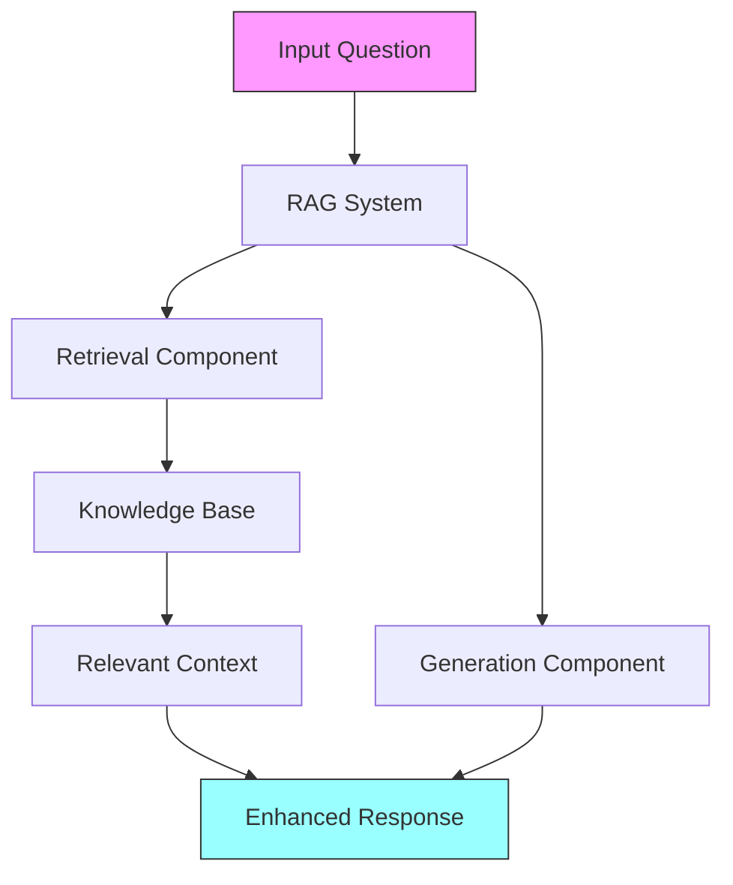
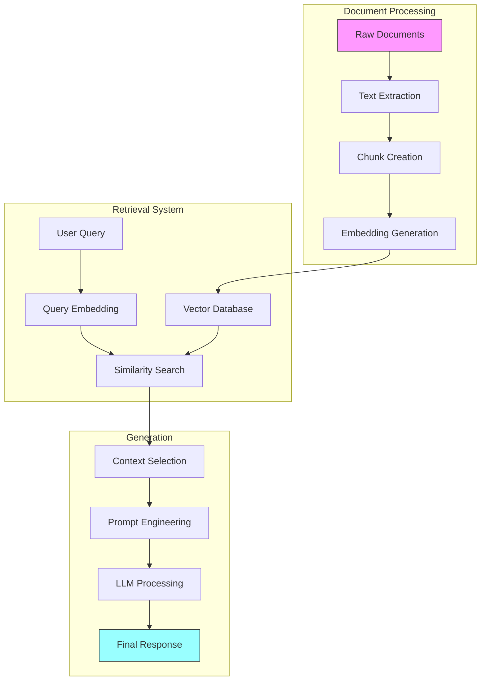
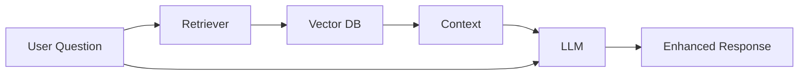
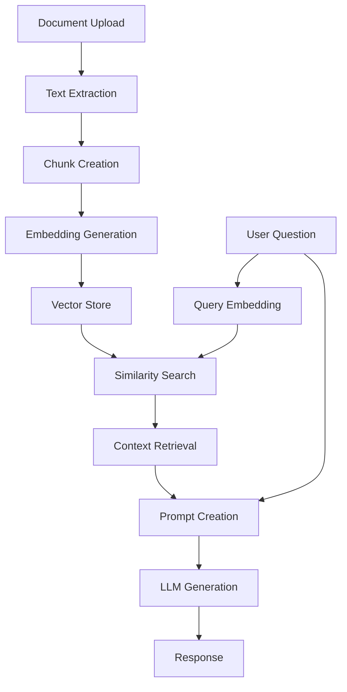

# Building a RAG System with Gemini and Hugging Face

## Introduction to RAG (Retrieval-Augmented Generation)

!!! abstract "In This Guide"
    Learn about RAG technology, how it works, and why it's revolutionizing AI applications. We'll explore the core concepts with clear examples and visual explanations.

### What is RAG?

Retrieval-Augmented Generation (RAG) is a powerful technique that enhances Large Language Models (LLMs) by providing them with relevant external information during text generation. Imagine giving your AI assistant a personal library that it can reference while answering your questions.



### Key Concepts

1. **Context Retrieval** 🔍
   - Searches through your documents
   - Finds relevant information
   - Uses semantic matching

2. **Embeddings** 🧬
   - Vector representations of text
   - Captures semantic meaning
   - Enables similarity search

3. **Vector Database** 💾
   - Stores document embeddings
   - Fast similarity search
   - Scalable information retrieval

4. **Prompt Augmentation** ✨
   - Combines question + context
   - Creates enhanced prompts
   - Guides LLM responses

5. **Generation Pipeline** 🔄
   - Processes enhanced prompts
   - Uses retrieved context
   - Produces accurate answers

### How RAG Improves LLM Responses

1. **Enhanced Accuracy** ✓
   ```mermaid
   graph LR
       A[Basic LLM] -->|Without RAG| B[Possible Hallucination]
       A -->|With RAG| C[Factual Response]
       style C fill:#9f9,stroke:#333
       style B fill:#f99,stroke:#333
   ```

2. **Knowledge Integration** 📚
   ```mermaid
   graph TD
       A[Your Documents] --> B[RAG System]
       C[LLM Knowledge] --> B
       B --> D[Combined Intelligence]
       style D fill:#9f9,stroke:#333
   ```

3. **Real-time Updates** 🔄
   ```mermaid
   graph LR
       A[New Information] --> B[Knowledge Base]
       B --> C[Immediate Availability]
       C --> D[Updated Responses]
       style D fill:#9f9,stroke:#333
   ```

### Technical Architecture



!!! tip "Key Terms Explained"
    - **Context Retrieval**: Finding relevant information in your documents
    - **Embeddings**: Numerical representations that capture meaning
    - **Vector DB**: Efficient storage and search of embeddings
    - **Prompt Augmentation**: Enhancing queries with context
    - **Generation Pipeline**: The process of creating responses

### Why Use RAG?

RAG solves several key challenges in AI applications:

1. **Knowledge Accuracy**:
   - Provides factual, up-to-date information
   - Reduces hallucinations and incorrect responses
   - Enables domain-specific knowledge integration

2. **Customization**:
   - Allows use of private or specialized data
   - Adapts LLM responses to specific contexts
   - Supports dynamic information updates

3. **Cost Efficiency**:
   - No need to fine-tune large models
   - Reduces token usage through targeted retrieval
   - Enables use of smaller, faster models

### How RAG Works



The RAG process follows three main steps:

1. **Retrieval**:
   - When a question is asked
   - System searches knowledge base
   - Finds most relevant information

2. **Augmentation**:
   - Combines question with retrieved context
   - Creates an enhanced prompt
   - Includes relevant background info

3. **Generation**:
   - Enhanced prompt sent to LLM
   - Model generates informed response
   - Output based on specific context

## Getting Started

### Prerequisites

Before we begin, you'll need:

1. **Google AI API Key**:
   - Visit [Google AI Studio](https://makersuite.google.com/app/apikey)
   - Click "Create API Key"
   - Copy and save your key securely

   ```mermaid
   graph TD
       A[Visit Google AI Studio] --> B[Click Create API Key]
       B --> C[Copy Key]
       C --> D[Store Securely]
   ```

2. **Python Environment**:
   - Python 3.7 or later
   - Required packages (will be installed)
   - Google Colab account (recommended)

### Setting Up Google Colab

1. **Create a new notebook**:
   - Go to [Google Colab](https://colab.research.google.com)
   - Click "New Notebook"
   - Rename it to "RAG_Workshop"

2. **Basic Colab operations**:
   - Add code cell: Click "+ Code" or use Ctrl+M B
   - Add text cell: Click "+ Text" or use Ctrl+M M
   - Run cell: Click play button or use Shift+Enter
   
### 1. Installing Dependencies

First, let's install the required packages:

```python
!pip install -q google-generativeai pypdf sentence-transformers faiss-cpu
```

These packages provide:
- `google-generativeai`: Access to Google's Gemini model
- `pypdf`: PDF document processing capabilities
- `sentence-transformers`: Text embedding generation
- `faiss-cpu`: Fast similarity search for vectors

### 2. API Configuration

Set up the Gemini API:

```python
import os
import getpass
import google.generativeai as genai

# Get API key securely
if "GEMINI_API_KEY" not in os.environ:
    os.environ["GEMINI_API_KEY"] = getpass.getpass("Enter your Gemini API key: ")

# Configure Gemini
genai.configure(api_key=os.environ["GEMINI_API_KEY"])
model = genai.GenerativeModel('gemini-2.5-flash')
```

### 3. Document Processing

Now we'll process PDF documents:

```python
from google.colab import files
from pypdf import PdfReader

def process_pdf():
    """Upload and process a PDF document."""
    print("Upload your PDF")
    uploaded = files.upload()
    
    if uploaded:
        # Get the filename
        pdf_filename = next(iter(uploaded))
        print(f"Processing: {pdf_filename}")
        
        # Read PDF content
        reader = PdfReader(pdf_filename)
        pdf_text = ""
        for page in reader.pages:
            pdf_text += page.extract_text()
        
        # Split into chunks
        text_chunks = [pdf_text[i:i + 1000] for i in range(0, len(pdf_text), 1000)]
        print(f"Created {len(text_chunks)} text chunks")
        return text_chunks
    return None

text_chunks = process_pdf()
```

!!! note "Document Processing"
    The chunk size of 1000 characters is a balance between:
    - Context window limitations
    - Semantic coherence
    - Processing efficiency

### 4. Embedding Generation

Now we'll create vector representations of our text:

```python
from sentence_transformers import SentenceTransformer

# Initialize the embedding model
embedding_model = SentenceTransformer('all-MiniLM-L6-v2')

# Generate embeddings
embeddings = embedding_model.encode(text_chunks)
print(f"Created {len(embeddings)} embeddings of dimension {embeddings.shape[1]}")
```

!!! info "About Embeddings"
    - Uses all-MiniLM-L6-v2 model
    - Creates 384-dimensional vectors
    - Captures semantic meaning
    - Enables similarity search

### 5. Vector Store Setup

We'll use FAISS to create a searchable database:

```python
import faiss
import numpy as np

# Create FAISS index
d = embeddings.shape[1]  # embedding dimension
index = faiss.IndexFlatL2(d)
index.add(np.array(embeddings).astype('float32'))
print(f"Created FAISS index with {index.ntotal} vectors")
```

!!! tip "FAISS Configuration"
    - Uses L2 distance metric
    - Performs exact search
    - Optimized for speed
    - Scales well with data

### 6. RAG Implementation

Here's our core RAG implementation:

```python
def get_rag_answer(query, k=3):
    """
    Performs retrieval-augmented generation.
    
    Args:
        query: User question
        k: Number of chunks to retrieve
    """
    # 1. Retrieval
    print("Converting query to embedding...")
    query_embedding = embedding_model.encode([query])
    
    print("Searching for relevant chunks...")
    distances, indices = index.search(
        np.array(query_embedding).astype('float32'),
        k
    )

    # 2. Augmentation
    print("Building context from chunks...")
    retrieved_chunks = [text_chunks[i] for i in indices[0]]
    context = "\n\n".join(retrieved_chunks)
    
    prompt = f"""Based on the following context, answer the question.
    Be clear, specific, and cite relevant information from the context.

Context:
{context}

Question: {query}

Answer:"""
    
    # 3. Generation
    print("Generating response...")
    response = model.generate_content(prompt)
    return response.text

# Example usage
example_question = "What are the key concepts discussed in the document?"
print("\nExample Question:", example_question)
print("\nAnswer:", get_rag_answer(example_question))
```

!!! example "How It Works"
    1. **Query Processing**:
       - Converts question to embedding
       - Matches against document vectors
       - Finds similar content

    2. **Context Retrieval**:
       - Gets top-3 relevant chunks
       - Combines retrieved text
       - Creates context block

    3. **Response Generation**:
       - Builds structured prompt
       - Sends to Gemini model
       - Returns generated answer

### 7. Interactive Interface

Let's create a user-friendly interface:

```python
import gradio as gr

def chat_with_pdf(question, history):
    """Handle chat interface."""
    if not question.strip():
        return "Please enter a question."
    
    try:
        answer = get_rag_answer(question)
        return answer
    except Exception as e:
        return f"Error: {str(e)}"

# Create interface
with gr.Blocks(theme=gr.themes.Soft()) as demo:
    gr.Markdown("# 📚 RAG-Powered Document Q&A")
    
    with gr.Row():
        with gr.Column():
            question_input = gr.Textbox(
                label="Your Question",
                placeholder="Ask about your document...",
                lines=3
            )
            submit_btn = gr.Button("Ask Question")
        
        with gr.Column():
            answer_output = gr.Textbox(
                label="Answer",
                lines=10
            )
    
    # Example questions
    gr.Examples([
        ["What are the main topics discussed?"],
        ["Summarize the key points in the document"],
        ["What specific details are mentioned about...?"]
    ], inputs=question_input)
    
    # Set up interaction
    submit_btn.click(
        fn=lambda q: chat_with_pdf(q, None),
        inputs=question_input,
        outputs=answer_output
    )

demo.launch(debug=True, share=True)
```

## Summary and Next Steps

### System Architecture



### Key Features
- PDF document processing
- Semantic search with embeddings
- Context-aware responses
- User-friendly interface

### Future Improvements

1. **Enhanced Retrieval**:
   - Smart text chunking
   - Improved similarity search
   - Multi-document support

2. **Better Generation**:
   - Source attribution
   - Confidence scores
   - Follow-up questions

3. **Interface Updates**:
   - Chat history
   - Document management
   - Result highlighting

!!! tip "Next Steps"
    - Try different chunking strategies
    - Experiment with embedding models
    - Add document preprocessing
    - Implement chat memory
    - Add error handling
    - Optimize response speed